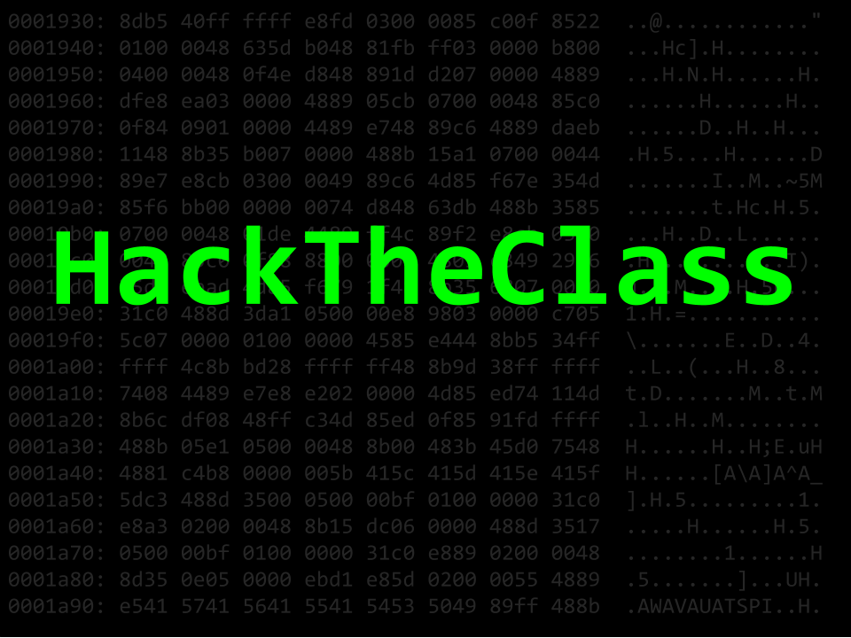

# CMSCXYZK: Introduction to Ethical Hacking (HackTheClass)

## Course Description
This practical, hands-on [1-credit course](http://sticsumd.com/) provides students with a foundation on ethical hacking. The course begins with a discussion on the ethics behind security research and progresses to topics that surround penetration testing, forensics, cryptology, and binary reverse engineering and exploitation. This course is also meant to introduce students to Capture-the-Flag (CTF) style cybersecurity challenges, encourages participation in UMD's Cybersecurity Club ([UMDCSEC](https://csec.umd.edu)), and prepares for CMSC414.

## Course Details
- **Course**: [CMSCXYZK](https://testudo.umd.edu)
- **Prerequisites**: C- or better in CMSC216 and CMSC250
- **Credits**: 1
- **Seats**: 30
- **Lecture Time**: Fridays, 3-3:50PM
- **Location**: CSI ABCD
- **Semester**: Spring 2018
- **Textbook**: None
- **Course Facilitators**: [Michael Reininger](https://www.github.com/1umpus), [William Woodruff](https://github.com/woodruffw)
- **Faculty Advisor**: [Dave Levin](http://www.cs.umd.edu/~dml/)
- **Syllabus Last Updated**: September 30, 2017

## Topics Covered
- Security research ethics
    - Cyberlaw
    - Responsible disclosure
    - Expectation of privacy

- Linux
    - Command line
    - Configuring an environment
    - Virtual machines

- Target reconnaissance
    - OSINT
    - Social engineering
    - OPSEC

- Penetration testing
    - Vulnerability scanning
    - Using automated tools
    - Maintaining persistence

- Forensics
    - Imaging
    - File types and carving
    - Metadata
    - File system artifacts
    - Password cracking
    - Network captures
    - Steganography

- Binaries
    - Reverse engineering
    - Stack-based buffer overflow
    - ROP & ret2libc
    - printf
    - Shellcode
    - Packing

- Web
    - Javascript deobfuscation
    - SQL injection
    - XSS & CSRF

- Crypto
    - Symmetric and asymmetric key
    - Padding oracle
    - Elliptic curve

- CTF
    - Jeopardy vs Attack-Defense
    - Write-ups

- Lock picking (if there is time)

## Grading
Grades will be maintained on the CS Department grades server.

You are responsible for all material discussed in lecture and posted on the class repository, including announcements, deadlines, policies, etc.

Your final course grade will be determined according to the following percentages:

| Percentage | Title | Description |
| ------------- | -----|-------- |
| 75% | Write-ups  | Weekly individual write-ups (250-500 words) that summarize the lecture and assigned CTF challenges. |
| 25% | Final Hack | Demonstrate mastery of all topics learned and apply knowledge to change your grade on the class's private grade server. The grade earned will be determined by levels unlocked in the grade server and will be applied to your official final grade. |

Any request for reconsideration of any grading on coursework must be submitted within one week of when it is returned. No requests will be considered afterwards.

## Schedule

| Week | Topic | Assignment |
| ----|----|----- |
| 1 (TBD) | Introduction + Ethics + Linux | Download [VirtualBox](https://www.virtualbox.org/), [Kali](https://www.kali.org/). Piazza. [Gray Hat Hacking (Ch. 1)](https://archive.org/details/GrayHatHackingTheEthicalHackersHandbook3rdEdition). [OSINT Handbook](http://www.i-intelligence.eu/wp-content/uploads/2016/11/2016_November_Open-Source-Intelligence-Tools-and-Resources-Handbook.pdf). [OPSEC](http://opsec.readthedocs.io/en/latest/). |
| 2 (TBD) | Linux + OSINT + OPSEC | RTFM. [Armitage](https://www.youtube.com/watch?v=kC3wpe3t_qg). Write-up 1. |
| 3 (TBD) | Vulnerability scanning | Write-up 2. |
| 4 (TBD) | Penetration testing I | Write-up 3. |
| 5 (TBD) | Penetration testing II | Write-up 4. |
| 6 (TBD) | Forensics I | Write-up 5. |
| 7 (TBD) | Forensics II | Write-up 6. |
| 8 (TBD) | Binaries I | Write-up 7. |
| 9 (TBD) | Binaries II | Write-up 8. |
| 10 (TBD) | Web I | Write-up 9. |
| 11 (TBD) | Web II | Write-up 10. |
| 12 (TBD) | Cryptology I | Write-up 11. |
| 13 (TBD) | Cryptology II | Write-up 12. |
| 14 (TBD) | CTF | Write-up 13. |
| 15 (TBD) | Lock picking | Write-up 14. |

## Communicating with course staff
Outside of class interaction between students and course staff will occur via piazza.
Email should only be used for emergencies and not class related questions.

Instructor:

Dr. Dave Levin - dml@cs.umd.edu

TAs:

Michael Reininger - michael@csec.umiacs.umd.edu

William Woodruff - william@yossarian.net

## Excused Absence and Academic Accommodations
See the section titled <a href="http://www.ugst.umd.edu/courserelatedpolicies.html">Course Related Policies</a>.

## Disability Support Accommodations
See the section titled "Accessibility" available at <a href="http://www.ugst.umd.edu/courserelatedpolicies.html">Course Related Policies</a>.

## Academic Integrity
Note that academic dishonesty includes not only cheating, fabrication, and plagiarism, but also includes helping other students commit acts of academic dishonesty by allowing them to obtain copies of your work. In short, all submitted work must be your own. Cases of academic dishonesty will be pursued to the fullest extent possible as stipulated by the <a href="http://osc.umd.edu/OSC/Default.aspx">Office of Student Conduct</a>.

It is very important for you to be aware of the consequences of cheating, fabrication, facilitation, and plagiarism. For more information on the Code of Academic Integrity or the Student Honor Council, please visit http://www.shc.umd.edu.

# Course Evaluations
If you have a suggestion for improving this class, don't hesitate to tell the instructor or TAs during the semester. At the end of the semester, please don't forget to provide your feedback using the campus-wide CourseEvalUM system. Your comments will help make this class better.

###### Thanks to the writers of <a href = "https://github.com/UMD-CS-STICs/389Kfall17">this</a> syllabus for the wording of much of this document.
